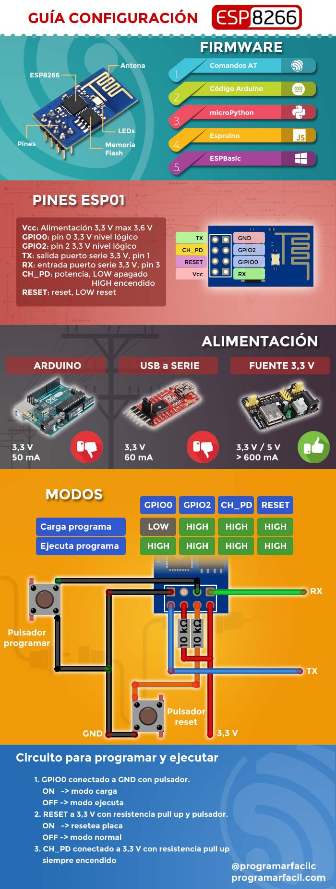

# Como configurar esp 8266 

+ [programarfacil.com](https://programarfacil.com/podcast/como-configurar-esp01-wifi-esp8266/) 

# Para ajustar el IDE de arduino 

+ se debe ir a preferencias-> ajustes-> y en el gestor de url adicionar http://arduino.esp8266.com/stable/package_esp8266com_index.json 
Luego ir a herramientas-> placas-> gestor de tarjetas-> se busca "esp" y se instala **ESP8266 by ESP8266 Community**, por ultimo se selecciona la placa **"Generic ESP8266 module"**

# Datasheet de ESP 8266 usada 
+ https://ecksteinimg.de/Datasheet/Ai-thinker%20ESP-01%20EN.pdf

# Como configurar 

**Imagen tomada de [programarfacil.com](https://programarfacil.com/podcast/como-configurar-esp01-wifi-esp8266/)**

# NOTA!!!!
+ Probado con version de IDE de arduino 1.8.7 version ESP8266 Community 2.4.2 
+ Se usa FT232RL, cuidado ya que los pines no estan donde deben segun el datasheet (version duplicada)
+ La ESP8266 es la que se usa en la imagen
+ El programa que se usa es el de encender led y se cambio el GPIO13 que no tiene por el 2 que esta libre
+ Se debe tener en cuenta que la conexion de arriba funciona pero en caso de que no cargue el programa (modo UART) se deben 
oprimir los dos botones al tiempo por unos 5 segundos
+ El codigo usado aunque pretende mostrar por monitor serie (IDE arduino) la ip y otra informacion acerca de la conexion, no lo ahce, por tanto es necesario de buscar la forma de imprimir la ip que el router asigna al dispositivo, o poder ingresar al router y ver los dispositivos conectados y su ip
